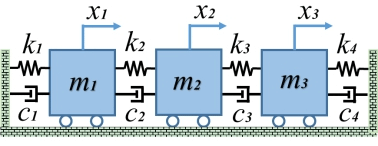
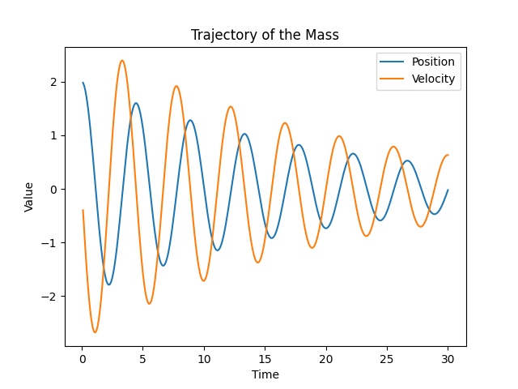

# PhysicsEngine - Simulating Mechanical Systems with C++

The **PhysicsEngine** is a C++ program that simulates mechanical systems using numerical methods. It provides a flexible framework to model and analyze multi-degree-of-freedom systems involving masses, springs, dampers, and external forces.

## Installation

To run the **PhysicsEngine**, follow these steps:

1. Start the development envrionment by running the docker container:
   ```
   ./runDocker
   ```

2. Build the executable by running the build script:
   ```
   scons
   ```

3. Navigate to the `exe` directory and run the executable:
   ```
   cd exe
   ./engine.exe
   ```

## Usage
Physics engine for simulation of mechanical systems with C++






The program demonstrates the simulation of a 3-degree-of-freedom (3-DOF) mechanical system consisting of masses, springs, dampers, and external forces. The coupling between the individual carts is defined through a coupling matrix. An impulse force is applied to the first cart at a specific time.

The program outputs the combined positions and velocities of the system, as well as the mass, damping, and stiffness matrices. Additionally, it calculates and displays the natural frequencies of the system.

Feel free to modify the parameters, coupling matrix, and force application in the `main.cpp` file to explore different scenarios and systems.

## Contributing

Contributions to the **PhysicsEngine** project are welcome! You can contribute by opening issues for bug reports or feature requests, or by submitting pull requests with enhancements.

## License

This project is licensed under the MIT License. You can find more details in the [LICENSE](LICENSE) file.

## Acknowledgments

The **PhysicsEngine** project is inspired by the need to simulate and analyze mechanical systems in a flexible and easy-to-use manner. It utilizes C++ and numerical methods to provide insights into the behavior of complex systems.


Enjoy simulating mechanical systems with the **PhysicsEngine**!