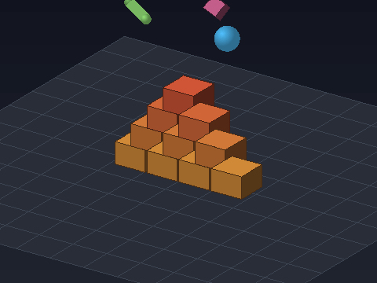

# libphys

GPU-batched physics for robot learning, with contact physics that is checked
against exact solutions, MuJoCo and real tactile-sensor data.

- **Batched**: thousands of independent environments stepped together on the
  GPU (or CPU), with state exposed as zero-copy PyTorch tensors.
- **Rigid bodies**: spheres, capsules, boxes, planes; friction, restitution;
  hinge, slider, ball and fixed joints with limits and torque / PD / velocity
  actuators.
- **Deterministic**: the CPU and CUDA backends produce bit-identical
  trajectories.
- **Tactile contact (research)**: an elastic contact patch that reproduces
  Hertz contact, partial slip and hysteresis, being validated on ~2,800 real
  GelSight / DIGIT trajectories ([docs/TACTILE.md](docs/TACTILE.md)).

C++ / CUDA core, Python front end. Developed and benchmarked on a Jetson Orin
NX.



## Quick start (Python)

Requirements: CUDA toolkit, CMake ≥ 3.18, a C++14 compiler, Python 3 with
`numpy`, `torch` and `pybind11` (`pip install pybind11`).

```bash
cmake -B build -DCMAKE_CUDA_ARCHITECTURES=87      # 87 = Orin; use your GPU's
cmake --build build -j
export PYTHONPATH=$PWD/python:$PYTHONPATH          # the module is built into python/libphys
python3 examples/cartpole.py                        # vectorized CartPole, random policy
```

```python
import torch
import libphys as lp

model = lp.Model(gravity=(0, -9.81, 0), substeps=10)
model.add_body(lp.Body.plane())
cart = model.add_body(lp.Body.none(1.0, (0.1, 0.1, 0.1)))     # no collision shape
pole = model.add_body(lp.Body.box((0.02, 0.5, 0.02), 0.1))
model.add_joint(lp.Joint.slider(-1, cart, (0, 0, 0), (0, 0, 0), (1, 0, 0)), actuator="torque")
model.add_joint(lp.Joint.hinge(cart, pole, (0, 0, 0), (0, -0.5, 0), (0, 0, 1)))

world = lp.World(model, num_envs=4096, device="cuda")
world.state.py[:, pole] = 0.5                 # write state directly (zero copy)
for _ in range(100):
    world.ctrl[:, 0] = torch.randn(4096, device="cuda")   # actuator inputs
    world.step(1 / 60)
    angle = world.joint_q[:, 1]                # joint readings, on the GPU
```

## Concepts

| | |
|---|---|
| `Model` | The scene shared by every env: bodies, joints, gravity, solver settings. Bodies and joints are numbered in the order added; `parent=-1` attaches a joint to the world. |
| `World(model, num_envs, device)` | `num_envs` independent copies of the model on `"cuda"` or `"cpu"`. Bodies in different envs never interact. |
| `world.state` | Body state as `[num_envs, num_bodies]` tensors that alias the simulator's buffers: `px, py, pz`, `vx, vy, vz`, quaternion `qw, qx, qy, qz`, angular velocity `wx, wy, wz`, `enabled`. Writing to them sets the state (resets are masked writes); helpers like `positions()` return stacked copies. |
| `world.ctrl` | Actuator inputs, `[num_envs, num_joints]`: torque / force, target position, or target velocity depending on the joint's actuator. |
| `world.joint_q`, `joint_qd` | Hinge angles / slider offsets and their velocities after the last step. |
| `world.step(dt, steps)` | Asynchronous on CUDA; torch and the simulator share CUDA's default stream, so tensor reads and writes are ordered with steps. |

Shapes are centred on their body; capsules run along the local y axis and
planes face local +y. A body with `mass <= 0` is static. Position actuators
are compliant constraints (compliance `1/kp`) rather than explicit PD forces,
so stiff gains on light finger links stay stable.

The same API is available in C++ (`src/phys/phys.h`): `phys::ModelDesc`,
`phys::World`, `phys::HostState`, and `World::state()` for raw device
pointers.

## Robots: URDF and the motion planner

`lp.load_urdf` builds a `Model` from a URDF: one body per link with mass,
at the link's centre of mass and along the principal axes of its inertia,
revolute / continuous / prismatic joints with the URDF limits and effort
limits, and fixed joints merged (tool frames) or welded. Collision geometry
is not imported yet (`sphere_radius=` gives a rough sphere per link).

The planner in `extern/MotionPlanning` (a submodule: `git submodule update
--init`) is exposed as `lp.Planner`: forward / inverse kinematics, `move_j`
(minimum-jerk joint-space) and `move_l` (straight Cartesian line). Plan on
the CPU, execute in thousands of envs on the GPU:

```python
robot = lp.load_urdf(urdf, kp=2e5, kd=2e3)          # dynamics, position actuators
planner = lp.Planner(urdf, dt=0.04)                 # kinematics, trajectories
plan, ok = planner.move_j(home, goal, 60)           # [waypoints, dof]; ok: reachable / IK converged
plan = torch.tensor(plan, device="cuda")
world = lp.World(robot.model, num_envs=1024, device="cuda")
world.set_configuration(robot, home)
world.ctrl[:] = plan[i]                              # joint targets, then world.step(...)
```

`examples/ur5e_planner.py` (and `.cpp`) plans a random MoveJ / MoveL per env
for a UR5e and tracks it under gravity: tracking error 0.0007 rad median,
tool within 0.1 mm of the plan's goal, ~100k env-steps/s from Python with
512 envs. Needs Eigen3 and tinyxml2 (`apt install libeigen3-dev
libtinyxml2-dev`); without them the rest of libphys builds as before.

`move_j` / `move_l` return `(plan, success)`; `success` is False when the
goal is outside the joint limits or IK failed along the line, so a plan can
be dropped instead of executed. The planner does no collision checking.

## What is validated

Every number below is a test or tool in this repo.

| Area | Check | Result |
|---|---|---|
| Contacts | Elastic bounce height, rolling sphere (5/7 v₀), sliding box stops at v²/2μg | 0.1%, 0.01%, 0.03% |
| Contacts | Box resting / dropped, 5-box stack, tipping box, capsule at rest | no drift > 0.1 mm; stack stands |
| Joints | Pendulum period vs analytic | 0.02% |
| Joints | Double pendulum, force-driven cart-pole vs exact equations of motion (references checked against MuJoCo to 1e-13) | 0.009 rad, 0.006 rad / 0.4 mm at 40 substeps; first-order convergence |
| Robots | UR5e from URDF: FK vs the planner's FK (200 random configurations); held under gravity at 1e5 gain | 7e-16 m, < 1e-6 rad; 4e-4 rad, tool 0.3 mm |
| Actuators | PD steady state under gravity; force-limited velocity drive | 2e-5 rad; 0.01% |
| Tactile | Hertz, flat punch, Cattaneo-Mindlin, Masing hysteresis | 0.07-2% |
| Tactile | Contact laws on real GelSight / DIGIT data | see [docs/TACTILE.md](docs/TACTILE.md) |
| Backends | CPU vs CUDA, run-to-run, env independence | bit-identical |

Run them: `ctest --test-dir build` (C++ and Python tests),
`python3 tools/check_references_mujoco.py`.

## Performance (Jetson Orin NX)

| Workload | Throughput |
|---|---|
| CartPole from Python, 4,096 envs, incl. torch-side resets (`examples/cartpole.py`) | 438k env-steps/s |
| 10 falling shapes per env, 4,096 envs (`bench_envs pile`) | 450k env-steps/s (22x one CPU core) |
| 12-joint actuated hand + cube, 1,024 envs (`bench_envs hand`) | 51k env-steps/s |
| 100,000 spheres in one scene, particle solver (`benchmark`) | 373 ms / 50 steps (9x a hand-optimized CPU loop) |

The GPU overtakes a single CPU core at about 64 envs. Full tables:
`./build/bench_envs`, `./build/benchmark`.

## Limitations

- Position-based joints are numerically damped at first order in the
  substep length (a 1.5 rad pendulum loses 18% of its energy in 10 s at 20
  substeps, 9% at 40). Reduced-coordinate articulations would remove this.
- Each env's contacts are solved by one GPU thread, with bodies laid out
  env-major: throughput for hand-sized envs drops beyond ~1,000 envs, and a
  single large scene runs faster on the CPU backend.
- No mesh collision, torsional / rolling friction, MJCF loading, URDF
  collision geometry or rendering yet. The tactile patch is not yet coupled into `World`.
- Kernel launch overhead dominates small batches (no CUDA graphs yet).

## Two solvers

`Model(solver="rigid")` (default) is the XPBD rigid-body solver above
(Macklin et al. 2020, with substeps). `Model(solver="particle")` is a
separate, simpler solver for very large single scenes of frictionless
spheres in axis-aligned walls, with a spatial-hash broadphase.


## Repository layout

```
src/phys/      the library: World API, rigid / particle solvers, joints, tactile patch
python/        Python package `libphys` (pybind11 bindings) and its tests
examples/      cartpole.py; ur5e_planner (.py/.cpp); GIF demos rigid_pile, particle_bounce, particle_pour (need ffmpeg)
benchmarks/    bench_envs (batched RL envs), benchmark (particle solver vs CPU baselines)
tests/         C++ tests
tools/         validation: MuJoCo reference check, Sparsh tactile data analysis
docs/          TACTILE.md, media
extern/        MotionPlanning (submodule): the motion planner
legacy/        earlier experiments (spring-mass visualizer, PINN, chaos demo); not built
```

## License

MIT. See [LICENSE](LICENSE).
