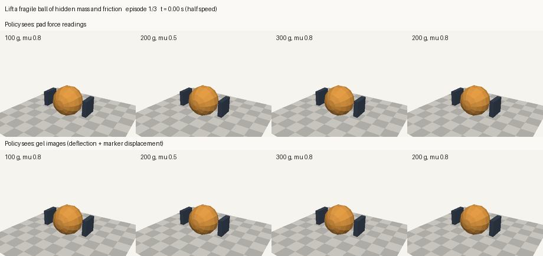
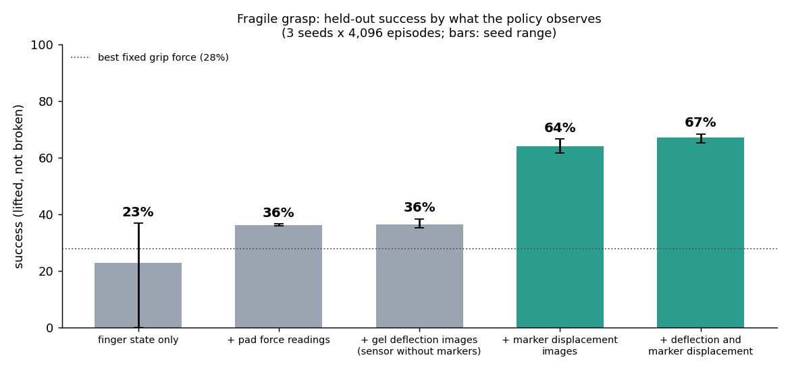

# libphys

**A GPU tactile simulator with partial-slip contact.** Gel fingertip pads
report pressure, shear and the gel's marker displacement, solved as an
elastic contact problem rather than with penalty springs. Policies trained
on these signals learn to grip just hard enough.



*Same hidden balls (mass, friction and fragility unknown to the policy),
two policies. Top: sees pad force readings. Bottom: sees the gel's
deflection and marker-displacement images. A ball that breaks turns red.*

## Result

> **67% vs 36%.** Lifting a fragile ball of unknown mass and friction, a
> policy that sees simulated gel images succeeds 67% of the time (65-68%
> over 3 seeds); one that sees pad force readings succeeds 36% (36-36%).
> Each figure is held-out success over 4,096 episodes per seed, in
> simulation. Source: [`results/grasp/eval.json`](results/grasp/eval.json).



**Why.** The gain comes from the marker displacement field; the deflection
image adds almost nothing (64% with marker displacement alone, 36% with
deflection alone).
- The ball's hidden friction sets how hard the grip must be, and force
  readings cannot measure it.
- As a grip nears slip, the rim of the contact starts sliding while the
  centre still sticks (Mindlin partial slip), and that shows in the marker
  displacement.
- The policy learns to tighten on that signal.

**Task.**
- A parallel-jaw gripper with a gel pad on each finger lifts a ball:
  0.05-0.4 kg, friction 0.3-0.8, both hidden.
- The ball breaks if gripped harder than 1.5-2.5x the least force that holds
  it.
- PPO, 18M env steps per run, trained on one Jetson Orin.

## Scope

- **Simulation only.** No hardware results.
- **Validated against theory, not sensors.** The tactile model is checked
  against closed-form contact mechanics ([tests](tests/test_tactile_sensor.cpp)):
  - Hertz contact radius, peak pressure and indentation, within 1%;
  - Mindlin stick radius, within one grid cell.

  It is not validated against measured sensor data. One check against real GelSight
  data already disagrees: see [docs/VALIDATION.md](docs/VALIDATION.md).
- **Not for rigid insertion.** Its box-box contact is wrong at edges, and
  MuJoCo is the better choice there: see [docs/DECISION.md](docs/DECISION.md).

## Run

Requirements: CUDA toolkit, CMake ≥ 3.18, a C++17 compiler, and Python 3
with `torch`, `numpy`, `pybind11`, `matplotlib`, `scipy` and `pillow`.

```bash
git clone --recursive https://github.com/luaiabuelsamen/PhysicsEngine && cd PhysicsEngine
cmake -B build -DCMAKE_CUDA_ARCHITECTURES=87      # 87 = Jetson Orin; use your GPU's
cmake --build build -j
export PYTHONPATH=$PWD/python:$PYTHONPATH
ctest --test-dir build                             # C++ and Python tests

# The result above
python3 examples/train_grasp.py --obs markers --seed 0 --updates 150 --out runs/markers_s0   # also: force, depth, shear, proprio, tactile
python3 examples/eval_grasp.py --runs runs --media .                            # held-out success, learning curves
python3 tools/plot_grasp_results.py --results runs/eval.json --out grasp_results.png
PYTHONPATH=examples:$PYTHONPATH python3 tools/make_hero_gif.py --out hero.gif   # uses results/grasp/policies
```

A pad on any body:

```python
import libphys as lp
model = lp.Model(gravity=(0, 0, -9.81))
finger = model.add_body(lp.Body.box((0.01, 0.01, 0.005), 0.05))
model.add_tactile_sensor(finger, origin=(0, 0, -0.005), frame=(0, 1, 0, 0),   # pad on the -z face
                         width=0.02, height=0.02, resolution=(16, 16))
world = lp.World(model, num_envs=4096, device="cuda")
world.step(1 / 240)
world.tactile[0]   # [4096, 7, 16, 16]: pressure, shear x/y, deflection, displacement x/y, stick
```

## More

- [docs/GUIDE.md](docs/GUIDE.md): full API, rigid-body solver, URDF and motion planner, validation tables, benchmarks.
- [docs/TACTILE.md](docs/TACTILE.md): the tactile model, and the analysis of real GelSight / DIGIT data.
- [docs/VALIDATION.md](docs/VALIDATION.md): what is and is not validated, with pass/fail criteria.
- [docs/DECISION.md](docs/DECISION.md): why this is not the simulator for rigid peg insertion.
- [CHANGELOG.md](CHANGELOG.md).

MIT license.
