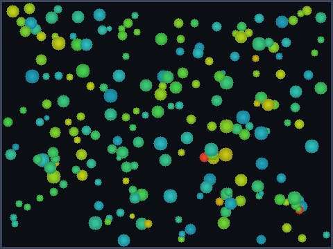

# GPU-Accelerated Physics Engine

A massively parallel rigid body dynamics simulator built with C++ and CUDA. Supports 100,000+ simultaneous objects with up to 50x speedup over CPU through CUDA kernel optimization, spatial hash broadphase, and memory coalescing.



*200 rigid bodies with gravity, sphere-sphere collisions, and impulse-based resolution. Color indicates velocity: teal (slow) to red (fast).*


*5 double pendulums with nearly identical initial conditions (0.01 rad apart) diverge chaotically. RK4 integration.*

## Architecture

### GPU Pipeline (per simulation step)

1. **Semi-implicit Euler Integration** - Each CUDA thread updates one body's velocity and position
2. **Spatial Hash Computation** - Maps each body to a 3D grid cell, computed in parallel
3. **Radix Sort** - Bodies sorted by grid cell hash using Thrust (O(n) on GPU)
4. **Cell Boundary Detection** - Identifies start/end of each cell in sorted array using shared memory
5. **Collision Detection & Resolution** - Each thread checks 27 neighboring cells for sphere-sphere collisions, applies impulse-based response with positional correction

### Key Optimizations

- **Structure-of-Arrays (SoA) layout**: Positions, velocities, and properties stored as separate contiguous arrays for coalesced GPU memory access. Threads in a warp access adjacent memory locations, maximizing bandwidth.
- **Spatial hash broadphase**: O(n) collision detection using uniform grid. Each body only checks neighboring cells instead of all-pairs O(n²).
- **Persistent GPU buffers**: Data stays on GPU across simulation steps - host-device transfers only at start and end.
- **Fast math intrinsics**: `rsqrtf()` for reciprocal square root, `__float2int_rd()` for float-to-int conversion.
- **Shared memory**: Cell boundary kernel uses shared memory to reduce global memory reads.
- **`__launch_bounds__`**: Collision kernel uses launch bounds for optimal register allocation.

## Benchmark Results

Tested on NVIDIA Jetson Orin NX (1024 CUDA cores, Ampere architecture):

```
Bodies    Steps   CPU Naive     CPU Opt       GPU (ms)      vs Naive      vs Opt
----------------------------------------------------------------------------------------
1,000     50      95 ms         29 ms         23 ms         4x            1x
5,000     50      2,349 ms      160 ms        35 ms         66x           4x
10,000    50      9,377 ms      335 ms        77 ms         121x          4x
25,000    50      58,640 ms     897 ms        82 ms         714x          10x
50,000    50      234,426 ms    1,871 ms      149 ms        1,573x        12x
100,000   50      ---           4,222 ms      350 ms        ---           12x
500,000   10      ---           ---           463 ms        ---           ---
```

- **CPU Naive**: Single-threaded O(n²) brute-force collision detection
- **CPU Opt**: Single-threaded with spatial hash broadphase
- **GPU**: CUDA with spatial hash + parallel narrowphase

## Building

### Prerequisites

- CUDA Toolkit 11.0+ (tested with 12.6)
- CMake 3.18+
- g++ with C++14 support

### Build

```bash
mkdir build && cd build
cmake .. -DCMAKE_CUDA_ARCHITECTURES=87  # adjust for your GPU
make -j$(nproc)
```

### Run Benchmark

```bash
# Full suite
./benchmark

# Custom: ./benchmark <num_bodies> [num_steps] [run_naive] [run_optimized_cpu]
./benchmark 100000 50 0 1
```

### Docker

```bash
docker build -t physics-engine .
docker run --gpus all physics-engine
```

## Project Structure

```
source/
  RigidBody.h              # SoA data structures for GPU memory coalescing
  cuda_rigid_body.cu/h      # CUDA kernels: integration, spatial hash, collision
  cpu_rigid_body.cpp/h      # CPU reference with spatial hash (for comparison)
  cpu_rigid_body_naive.cpp/h # CPU O(n^2) brute-force baseline
  benchmark.cpp             # Benchmark harness with CPU vs GPU comparison
  visualize.cpp             # 2D rigid body renderer - outputs GIF via ffmpeg
  visualize_pendulum.cpp    # Double pendulum chaos visualization
  main.cpp                  # Interactive spring-mass visualization (OpenGL)
  MechanicalSystem.cpp/h    # Single-DOF mechanical system solver
  MultiMechanicalSystem.cpp/h # Multi-DOF coupled system solver
  cuda_mass_spring.cu/h     # CUDA kernel for mass-spring systems
  ode.h                     # RK4 ODE solver
CMakeLists.txt              # Build system for rigid body engine
SConstruct                  # Build system for spring-mass visualization
Dockerfile                  # CUDA-enabled container
```

## License

MIT License. See [LICENSE](LICENSE) for details.
