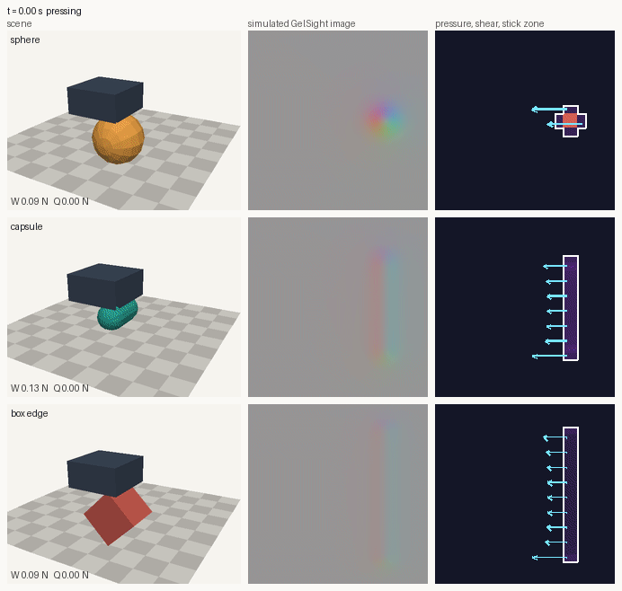
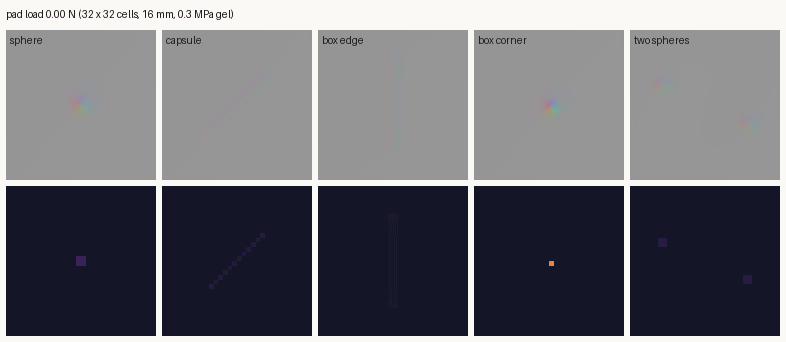
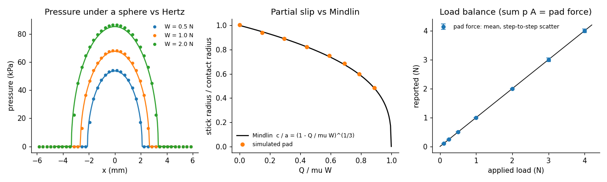
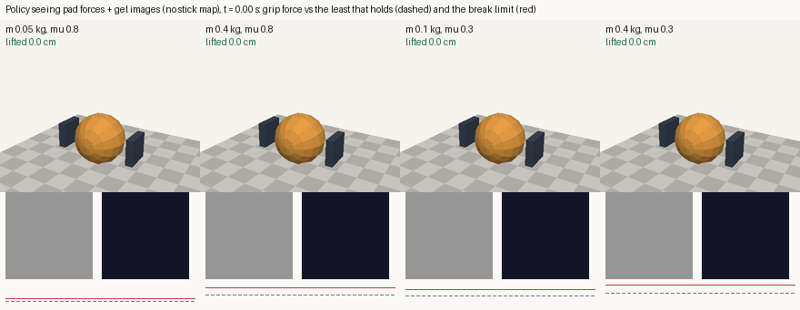
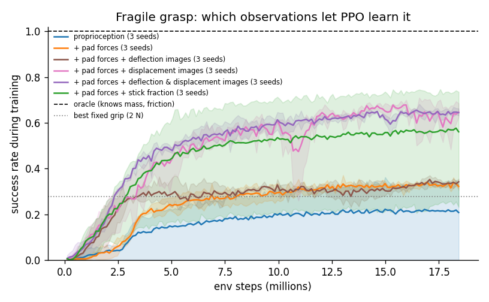
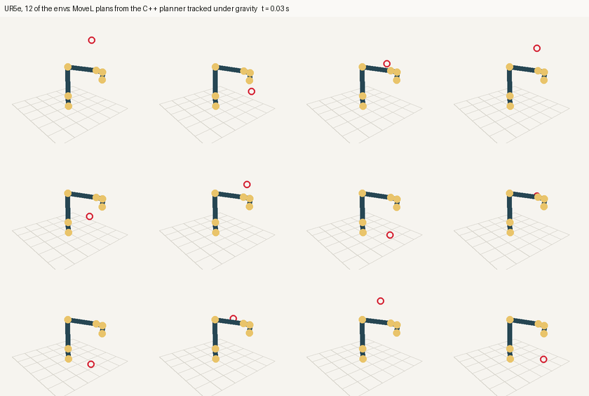

# libphys: full guide

The short version is the [README](../README.md).

GPU-batched robot simulation with physically grounded touch. Thousands of
environments step together on one GPU, and **tactile sensor pads** on any
body report what a gel fingertip would feel:
- pressure;
- shear;
- the gel's deformation;
- where the contact sticks or slips.

The pads solve an elastic contact problem rather than using penalty
springs, and the gel acts back on the dynamics: objects indent it as far as
the gel model says, and grip turns into slip gradually, as Mindlin's theory
predicts.

**Scope.** The rigid solver is checked against exact solutions and MuJoCo
reference trajectories, and the tactile model against closed-form contact
mechanics (Hertz, Mindlin). **Neither is validated against measured sensor
or robot data yet.** The gel is an idealised linear elastic half-space;
whether it matches real GelSight / DIGIT gels is open (see "Real sensors"
below). All RL results are in simulation.



*One env per row, simulated together. Left: the scene. Middle: the gel as a
GelSight camera would see it, shaded from the simulated deflection. Right:
pressure, shear (arrows) and the sticking zone (white outline). Pressed, the
contact sticks; dragged, the stick zone shrinks from the edges inwards until
the whole contact slides.*

**What's in it**

- **Batched rigid bodies.**
  - Shapes: spheres, capsules, boxes, planes.
  - Contacts: friction and restitution.
  - Joints: hinge, slider, ball and fixed, with limits and torque / position /
    velocity actuators.
  - Solver: XPBD with substeps.
  - State is exposed as zero-copy PyTorch tensors.
- **Tactile sensor pads.**
  - The gel is an elastic half-space. It gives Hertz pressure under curved
    objects, Mindlin partial slip under shear, and the deflection map that
    vision-based sensors image.
  - Two-way coupled: the gel's normal and shear compliance act in the rigid
    solve, so indentation and the stick-to-slip transition come out of the
    dynamics.
  - About 185k env-steps/s with a 16 × 16 pad on a Jetson Orin NX.
- **Robots.**
  - URDF import.
  - A C++ motion planner (forward / inverse kinematics, MoveJ, MoveL) whose
    trajectories run in thousands of envs at once.
- **Deterministic.** The CPU and CUDA backends produce bit-identical results,
  so the CPU doubles as a reference.
- **Batteries for looking at things.** `libphys.viz` is a dependency-light
  renderer for scenes and simulated sensor images, used for every GIF here.

C++ / CUDA core, Python front end. Developed on a Jetson Orin NX; any CUDA
GPU works.

## Build

Requirements:
- CUDA toolkit, CMake ≥ 3.18 and a C++17 compiler.
- Python 3 with `torch`, `numpy` and `pybind11`.
- Optional:
  - `libtinyxml2-dev` and `libeigen3-dev`: URDF import and the motion planner.
  - `ffmpeg`: GIF output.
  - `scipy`, `matplotlib`, `pillow`: visualization and tools.

```bash
git clone --recursive https://github.com/luaiabuelsamen/PhysicsEngine   # or: git submodule update --init
cmake -B build -DCMAKE_CUDA_ARCHITECTURES=87      # 87 = Orin; use your GPU's
cmake --build build -j
export PYTHONPATH=$PWD/python:$PYTHONPATH          # the module is built into python/libphys
ctest --test-dir build                             # C++ and Python tests
```

## Quick start

A fingertip with a tactile pad presses a ball into the floor in 1,024 envs,
a little harder in each:

```python
import torch
import libphys as lp

model = lp.Model(gravity=(0, 0, -9.81), substeps=20)
model.add_body(lp.Body.plane(), friction=0.8)                    # floor
finger = model.add_body(lp.Body.box((0.01, 0.01, 0.005), 0.05))
ball = model.add_body(lp.Body.sphere(0.012, 0.02))
model.add_joint(lp.Joint.slider(-1, finger, (0, 0, 0.03), (0, 0, 0), (0, 0, 1)),
                actuator="position", kp=200.0, kd=5.0)            # finger moves up / down
model.add_tactile_sensor(finger, origin=(0, 0, -0.005), frame=(0, 1, 0, 0),  # pad on the -z face
                         width=0.02, height=0.02, resolution=(16, 16))

world = lp.World(model, num_envs=1024, device="cuda")
s = world.state                                  # [num_envs, num_bodies] tensors, zero copy
s.qw[:, 0] = s.qx[:, 0] = 0.5 ** 0.5             # turn the floor to face +z (planes face local +y)
s.pz[:, finger], s.pz[:, ball] = 0.03, 0.012
world.ctrl[:, 0] = torch.linspace(-0.004, -0.008, 1024, device="cuda")   # finger targets

for _ in range(240):
    world.step(1 / 240)
pressure = world.tactile[0][:, 0]                # [1024, 16, 16] Pa, on the GPU
force = world.tactile_force[:, 0]                # [1024, 3]: shear x, shear y, normal (N)
```

More in `examples/`:

| Example | |
|---|---|
| `tactile_demo.py` | The GIF above: a fingertip pressed and dragged across three objects |
| `tactile_gallery.py` | Simulated sensor images of five objects under a rising load |
| `grasp_env.py`, `train_grasp.py`, `eval_grasp.py`, `probe_grasp.py` | Fragile grasping: an RL task where touch matters; PPO; evaluation; what a policy uses |
| `ur5e_planner.py` / `.cpp` | Plan MoveL / MoveJ for a UR5e per env, track the plans under gravity |
| `cartpole.py` | Vectorized CartPole from Python |
| `rigid_pile.cpp`, `particle_pour.cpp`, `particle_bounce.cpp` | Rigid and particle solver demos (write GIFs via ffmpeg) |

## Tactile sensors



`model.add_tactile_sensor(body, origin, frame, width, height, resolution,
youngs_modulus, poisson, dome_radius, thickness, coupled)` puts a rectangular gel pad on a body,
on the face of its collision shape that touches things. The pad's normal is
the +z axis of `frame`.

After every step, `world.tactile[i]` holds sensor `i`'s cells as
`[num_envs, 7, ny, nx]`. The channels are:

| # | Channel | |
|---|---|---|
| 0 | `pressure` | Pa |
| 1, 2 | `shear_x`, `shear_y` | Pa, in the pad frame |
| 3 | `deflection` | m, normal deflection of the gel: the depth map a GelSight / DIGIT camera sees |
| 4, 5 | `displacement_x`, `displacement_y` | m, tangential gel displacement: what markers show |
| 6 | `stick` | 1 where the contact sticks, 0 where it slips |

`world.tactile_force` holds each pad's total force, `[num_envs, num_sensors,
3]`.

How it works (details in [docs/TACTILE.md](TACTILE.md)):

1. **The gel acts in the rigid solve (two-way coupling, `coupled=True`).**
   Contacts on a pad become compliant, with the gel's stiffness from the last
   step's tactile solve, so an object indents the pad as far as the gel
   model says. Friction on the pad is the gel's shear: Mindlin's force law,
   Q = μW[1 − (1 − u/u*)^{3/2}], acting on a persistent shear deflection u,
   so grip turns into slip over a fraction of a millimetre instead of at
   once.
2. **The pad's load is the contact force on its face,** averaged over the
   step's substeps.
3. **The gap comes from the touching objects.** Rays are cast from every cell
   along the pad normal against their shapes.
4. **Pressure is solved for that load.** The pad solves the elastic
   half-space contact problem, so the pressure is consistent with both the
   shape and the load (Polonsky–Keer conjugate gradient, warm-started across
   steps).
5. **Shear and the stick zone use the Ciavarella–Jäger construction,** the
   same Mindlin theory as the dynamics.
6. **One CUDA block per (env, sensor).** The CPU backend reproduces the GPU
   bit for bit.

With `coupled=False` a pad only observes ordinary rigid contacts.



*A pad pressed onto a fixed sphere by slider forces, against closed-form
contact mechanics (`tools/plot_tactile_validation.py`;
`tests/test_tactile_sensor.cpp`).*

`libphys.viz.gelsight(reading, cell)` and `viz.tactile_map(reading)` turn a
reading into the images above.

**Real sensors: not validated.** `tools/` contains an exploratory analysis
of Meta's Sparsh datasets (~2,800 GelSight Mini and DIGIT press-and-slide
trajectories with forces). It fits contact laws to the data; it does not
compare simulator output with measurements. Findings so far:
- **Pressing:** fitted force-depth exponents (DIGIT 1.58, GelSight 1.36)
  are closer to an elastic half-space (1.5) than to Winkler / hydroelastic
  springs (2). The GelSight value is below what any linear elastic gel
  model gives, most likely because of rig compliance.
- **Shear from force traces:** dominated by test-rig compliance, so the
  traces cannot tell the contact models apart.
- **Contact radius from images:** grows with load between the two models'
  predictions, which the simulator's model does not reproduce.

Details: [docs/TACTILE.md](TACTILE.md).

## RL with touch: fragile grasping (simulation)



*A policy that sees the gel deflection and displacement images, on four
hidden balls.
Below each: the simulated sensor image, pressure with shear, and the grip
force against the least force that holds the ball (dashed) and the break
limit (red). The lightest, grippiest ball breaks.*

`examples/grasp_env.py` is a batched RL task where touch matters:
- **Setup.** A parallel-jaw gripper with a coupled gel pad on each finger
  must lift a ball whose mass (0.05-0.4 kg) and friction (0.3-0.8) are
  hidden and change every episode.
- **Fragility.** The ball breaks if a pad presses harder than 1.5-2.5x the
  least force that holds it, so the right grip spans a factor of 20. Squeeze
  too little and it slips out; too much and it breaks.
- **Control.** The lift is scripted; the policy adjusts the grip force.

PPO (`examples/train_grasp.py`) is trained with six observation sets,
3 seeds each, 18M env steps per run (about 11 minutes per run on the Orin
when trained alone). The
results below are from 4,096 held-out episodes per policy
(`examples/eval_grasp.py`):

| Policy observes | Success: mean over seeds (range) | Broken | Dropped |
|---|---|---|---|
| (fixed grip, best: 2 N) | 28% | 32% | 41% |
| finger positions and velocities, grip, time | 23% (0-37%) | 24% | 54% |
| + each pad's normal and shear force | 36% (36-36%) | 28% | 36% |
| + each pad's gel deflection image (a sensor without markers) | 36% (35-38%) | 64% | 0% |
| **+ each pad's gel displacement images (markers)** | **64% (62-67%)** | 36% | **0%** |
| + deflection and displacement images | 67% (65-68%) | 33% | 0% |
| + each pad's stick fraction (a scalar instead of images) | 59% (25-75%) | 19% | 22% |
| (oracle that knows mass and friction) | 100% | 0% | 0% |

Images are 12 x 12 per pad, with no stick map.



**Why touch helps, and which touch.**
- **Forces are not enough.** Pad forces give the ball's weight but not its
  friction, and stop at 36%.
- **The marker displacement field is the useful signal.** That is the gel's
  sideways displacement, which a vision-based sensor shows through markers
  printed on the gel.
  - As the grip nears slip, the outer ring of the contact starts slipping
    while the centre still sticks (Mindlin partial slip), and that changes
    the displacement field.
  - From displacement images alone, the policy learns a grip reflex: it
    tightens just enough as the load comes on, and never drops a ball on any
    seed.
- **The deflection image (depth map) is not enough on its own.** It is all a
  sensor without markers sees. Here it changes with the load but not with
  the shear: for an incompressible gel, normal and tangential responses
  decouple. So it does no better than force readings: it avoids drops by
  squeezing hard, and breaks balls instead.
- **The stick fraction is a less reliable shortcut.** Handed the share of
  the contact that still sticks as a single number, PPO reaches 75% on two
  seeds but stalls at 25% on the third.
- **Remaining failures** are breaks of the lightest, grippiest balls, for
  which even the 0.4 N starting grip is over the limit.
- **What the full-image policy uses** (`examples/probe_grasp.py`, holding
  one input group at its training mean):
  - Without the deflection images it falls from 67% to 7%: this policy reads
    the load from the depth map and ignores the force readings. A policy
    trained without depth maps reads the load from the forces instead (the
    displacement-only row).
  - Without the displacement along the lift it falls to 19%.
  - The pad force readings and the displacement across the lift make no
    difference.

A contact model with a single friction state per contact, such as rigid
Coulomb friction, cannot produce this signal; it needs a model of partial
slip across the contact patch.

## Robots: URDF and the motion planner



```python
robot = lp.load_urdf("ur5e.urdf", kp=2e5, kd=2e3)   # bodies, inertias, joint and effort limits
planner = lp.Planner("ur5e.urdf", dt=0.04)          # kinematics and trajectories
plan, ok = planner.move_l(home, goal_pos, goal_quat, 60)     # [waypoints, dof]; ok: IK converged
world = lp.World(robot.model, num_envs=1024, device="cuda")
world.set_configuration(robot, home)
world.ctrl[:] = torch.tensor(plan[i], device="cuda")         # joint targets per step
```

**URDF import.**
- Each link with mass becomes a body at its centre of mass, along the
  principal axes of its inertia.
- Revolute, continuous and prismatic joints become hinges and sliders, with
  the URDF's limits.
- Fixed joints are merged or welded.
- Collision geometry is not imported yet.

**Motion planner.** The planner
([MotionPlanning](https://github.com/luaiabuelsamen/MotionPlanning),
`extern/`) is header-only C++:
- forward kinematics along the URDF tree;
- damped-least-squares IK with step limiting and convergence reporting;
- minimum-jerk MoveJ;
- MoveL with a success flag.

In `examples/ur5e_planner.py`, 512 envs track random MoveL plans with a
median joint error of 0.0007 rad and end within 0.1 mm of the goal, at
~100k env-steps/s from Python.

## Rigid bodies


| | |
|---|---|
| `Model` | The scene shared by every env: bodies, joints, tactile sensors, gravity, solver settings. Bodies and joints are numbered in the order added; `parent=-1` attaches a joint to the world. |
| `World(model, num_envs, device)` | `num_envs` independent copies on `"cuda"` or `"cpu"`. Bodies in different envs never interact. |
| `world.state` | `[num_envs, num_bodies]` tensors aliasing the simulator's buffers: `px, py, pz`, `vx, vy, vz`, quaternion `qw, qx, qy, qz`, angular velocity `wx, wy, wz`, `enabled`. Writing them sets the state; resets are masked writes. |
| `world.ctrl` | Actuator inputs, `[num_envs, num_joints]`: torque / force, target position or target velocity. |
| `world.joint_q`, `joint_qd` | Joint positions and velocities after the last step. |
| `world.step(dt, steps)` | Asynchronous on CUDA. Torch and the simulator share the default stream, so tensor reads and writes are ordered with steps. |

**Conventions and semantics.**
- Shapes are centred on their body; capsules run along local y, and planes
  face local +y.
- A body with `mass <= 0` is static.
- Position actuators are compliant constraints (compliance `1/kp`), so stiff
  gains on light links stay stable.
- `Model(solver="particle")` selects a separate solver for very large single
  scenes of frictionless spheres.

**C++.** The same API is in `src/phys/phys.h` (`phys::ModelDesc`,
`phys::World`, `phys::HostState`, `phys::load_urdf`).

## Validation

Every number is a test or tool in this repo.

| Area | Check | Result |
|---|---|---|
| Contacts | Elastic bounce height; rolling sphere (5/7 v₀); sliding box stops at v²/2μg | 0.15%, 0.01%, 0.03% |
| Contacts | Box resting / dropped; 5-box stack of 1 m boxes; tipping box; capsule at rest | < 0.1 mm drift; 7 mm; topples / settles as expected |
| Joints | Pendulum period | 0.02% |
| Joints | Double pendulum, cart-pole vs exact equations of motion (references checked against MuJoCo to 1e-13) | 0.009 rad, 0.006 rad / 0.4 mm at 40 substeps |
| Actuators | PD steady state under gravity; force-limited velocity drive | 2e-5 rad; 0.01% |
| Tactile pads | Pad load vs applied; Hertz radius / peak pressure; Mindlin stick radius; full slip | 0.02%; 0.5% / 1%; within one cell; exact |
| Tactile coupling | The pad body's indentation vs Hertz; its shear displacement vs Mindlin; step-to-step force scatter at 10 substeps | 0.6%; < 0.5%; < 1e-5 |
| Tactile patch | Hertz, flat punch, Cattaneo–Mindlin, Masing hysteresis (standalone `ElasticPatch`) | 0.07–2% |
| Robots | UR5e: URDF tree FK vs the planner's FK; arm held under gravity | 7e-16 m; 4e-4 rad |
| Backends | CPU vs CUDA, run-to-run, env independence | bit-identical |

## Performance (Jetson Orin NX, 16 GB)

| Workload | Throughput |
|---|---|
| CartPole from Python, 4,096 envs | 345k env-steps/s |
| 10 falling shapes per env, 4,096 envs (`bench_envs pile`) | 409k env-steps/s |
| 12-joint actuated hand + cube, 1,024 envs (`bench_envs hand`) | 48k env-steps/s |
| Pad pressed onto a sphere under shear, 4,096 envs: no sensor / 16 × 16 pad / 32 × 32 pad (coupled) | 881k / 185k / 25k env-steps/s |
| UR5e tracking planned trajectories, 512 envs, from Python | 101k env-steps/s |
| 100,000 spheres in one scene, particle solver (`benchmark`) | 373 ms / 50 steps |

## Limitations

- **No shear hysteresis yet.** The coupled shear follows Mindlin's loading
  curve both ways, so partial-slip unloading and reversal dissipate nothing
  until the contact fully slides (the standalone `ElasticPatch` has Masing
  hysteresis).
- **The gel covers the face.** Coupling applies to contacts within one pad
  size of a pad on its face, so place pads over the faces that touch things.
- **Linear gel.** The gel is a linear elastic half-space. A sharp corner is
  a point load on it, so coupled indentation is capped at half the gel's
  `thickness` (it bottoms out on its backing).
- **Uncoupled rigid contacts chatter.** When pushed through joints, a rigid
  contact's force scatters step to step: about 8% at 10 substeps under
  shear, 2% at 40 substeps above 3 N. The means are exact, and coupled pads
  don't chatter.
- **Large pads are slow.** The pad's influence sums are dense; 32 × 32 is
  about 10× slower than 16 × 16.
- **Damped joints.** Position-based joints are damped at first order in the
  substep length: a 1.5 rad pendulum loses 9% of its energy in 10 s at 40
  substeps.
- **Rigid box-box contact at edges is unreliable.** In a matched peg-in-hole
  sweep, libphys topples pegs at the hole rim that a near-rigid MuJoCo
  reference inserts, at every tilt tested. It is not suitable for
  insertion contact: see [docs/DECISION.md](DECISION.md) and
  `results/peg_hole/`.
- **Not yet supported:**
  - mesh collision;
  - torsional or rolling friction;
  - URDF collision geometry;
  - MJCF loading.

## Repository layout

```
src/phys/      the library: World, rigid / particle solvers, joints, tactile sensors, URDF import
python/        Python package libphys (bindings, viz) and its tests
examples/      demos (tactile, fragile-grasp RL, UR5e, CartPole, rigid / particle GIFs)
tests/         C++ tests
benchmarks/    bench_envs (batched RL envs), benchmark (particle solver vs CPU baselines)
tools/         validation figures, MuJoCo reference check, Sparsh tactile data analysis
extern/        MotionPlanning (submodule)
docs/          TACTILE.md (tactile model, Sparsh data analysis), VALIDATION.md, DECISION.md, media
legacy/        earlier experiments, not built
```

## License

MIT. See [LICENSE](../LICENSE).
