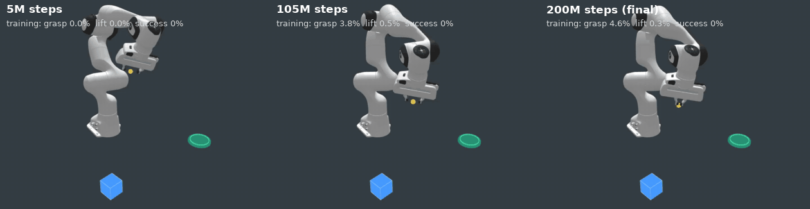
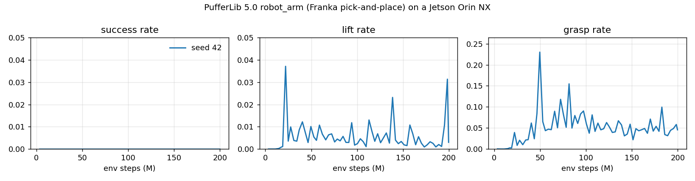

# PufferLib robot_arm on the Jetson Orin



**Results so far:**
- **Build.** PufferLib 5.0's `robot_arm` (Franka pick-and-place, GPU
  physics) now builds on aarch64, with a `build.sh` patch (+23/-2 lines).
- **Training.** It trains on the Orin at about 11K steps/s.
- **Learning.** In 200M steps (20% of its configured budget), seed 42
  never completes a pick-and-place:
  - The grasp rate peaks at 23%, then settles near 5%.
  - The final policy pushes the cube away from itself.
- **Seeds 1 and 2** were not run. The orchestrator cancelled them: the
  GPU belongs to the flagship, and seed 42 showed no learning at this
  budget.

Sources:
- Learning curves: `results/pufferlib_robot_arm/runs.json` (from
  `results/pufferlib_robot_arm/logs/seed42_1791353319249.ini`).
- Build logs: `results/pufferlib_robot_arm/logs/build_*.log`.

## Build fix

| Build on aarch64, clang 14, commit `6ffa5b1` | Stock | Patched |
|---|---|---|
| `./build.sh robot_arm` | `Error: ocean/robot_arm/robot_arm.cu must typedef obs_t` | builds |
| `./build.sh cartpole` / `breakout --cu` / `cartpole --cpu` | `libraylib.a: error adding symbols: file in wrong format` | build |

The two causes:
- **raylib.** It has no Linux arm64 release, and `build.sh` links the
  amd64 archive. This breaks every env on aarch64.
- **obs_t check.** The check reads only `robot_arm.cu`, but the typedef is
  in `robot_arm.h`. This breaks robot_arm on every platform.

The patch:
- builds raylib 5.5 from source on Linux aarch64;
- for `.cu` envs, also accepts the typedef from the env's `.h`.

It is on branch `fix/robot-arm-aarch64-build` (commit `6901c83`) in
`~/projects/PufferLib-jetson`, with a PR description in `PR_DESCRIPTION.md`
there. It has not been pushed.

## Training (seed 42)

- **Config.** Upstream `config/robot_arm.ini` with 4,096 envs, horizon 128,
  a 2 x 256 MLP and 413K parameters. The only change is
  `total_timesteps` = 200M; upstream uses 1B.
- **Machine.** The GPU was shared with other jobs throughout.

| | Value |
|---|---|
| Steps | 199.8M in 5.06 h |
| Steps/s | 10,955 mean (64 bins: 7.3K-16.5K, median 11.0K) |
| Success rate | 0 throughout |
| Grasp rate | peak 0.23 at 49.6M steps; 0.05 over the last 8 bins |
| Lift rate | peak 0.037 at 22.0M steps; 0.007 over the last 8 bins |
| Transport rate | at most 0.0009 |



**Rollout cost.** The rollout (env physics plus the policy forward pass)
takes 78-87% of each epoch (87% in
`results/pufferlib_robot_arm/logs/seed42_final_dashboard.log`). robot_arm's articulated contact physics is
about 100x slower per step than breakout's GPU env on the same machine
(0.93-1.27M steps/s, `results/pufferlib_spike/summary.json`).

**What the GIF shows.** Each panel is one rendered env from the start of
an episode. The labels are the training-log rates at that checkpoint.
- **5M steps:** the arm moves without purpose.
- **105M steps:** it holds its hand near the cube.
- **200M steps:** it pushes the cube out of the camera's view within about
  5 s and then stays still. The cube is visible in 0% of frames after
  that.
- This behaviour appears between the 157M checkpoint (cube in view for
  the whole 24 s render) and the two 199M checkpoints (cube out of view).

## Pass / fail (criteria in STATUS.md, written before the runs)

| Item | Result |
|---|---|
| (1) Patch builds robot_arm on aarch64; no change for envs that already build | **pass** on aarch64, where every env failed before. x86_64 is untested here; the raylib change applies only when `uname -m` is aarch64/arm64 |
| (2) 3 seeds finish; rates at the end above the first logged values for ≥2 of 3 seeds | **not completed**: seeds 1 and 2 cancelled (GPU priority). Seed 42 ends above its start on grasp (0.000 → 0.046) and lift (0.000 → 0.003), with success 0 |
| (3) GIF 8-15 s, ≤ 5 MB, rendered on the Jetson | **pass** (12 s, 1.7 MB). It shows no successful pick-and-place |
| (4) Local PR branch and description, not pushed | **pass** |

The 200M budget was set by the shared GPU (about 20 h per seed for 1B
steps). Whether robot_arm learns the task at its full 1B budget on this
machine is untested.

## Reproduce

```bash
cd ~/projects/PufferLib-jetson        # branch fix/robot-arm-aarch64-build
./build.sh robot_arm                  # clang, CUDA, NCCL wheel with libnccl.so symlink
./puffer train --base.seed=42 --train.total_timesteps=200000000 --sweep.downsample=64
python3 tools/puffer_robot_arm_results.py 42=<logs/robot_arm/RUN.ini> \
    --out results/pufferlib_robot_arm --fig docs/media/robot_arm_curves.png
# render: ./puffer eval checkpoints/robot_arm/RUN/STEP.bin under xvfb-run, captured with ffmpeg x11grab
```
